# Fixly Platform 🚀

Fixly is a full-stack service booking platform designed to connect users with trusted service providers.
It enables seamless service discovery, booking management, and administrative control through a modern web application.

---

## 🏗 Project Structure

This repository follows a **monorepo architecture**:

```
Fixly
├── backend      # Spring Boot backend application
└── frontend     # React frontend application (Vite)
```

---

## ✨ Features

### 👤 Users

- User registration and authentication
- Browse and book services
- Manage bookings and profile

### 🛠 Service Providers

- Manage services
- View and manage bookings
- Profile management

### 🛡 Admin

- Manage users and providers
- Monitor platform activity
- Control services and bookings

---

## ⚙️ Tech Stack

### Backend

- Java
- Spring Boot
- Spring Security
- REST APIs
- MySQL
- Maven

### Frontend

- React (Vite)
- JavaScript (ES6+)
- HTML5
- CSS3
- Axios

### Tools

- Git & GitHub
- VS Code
- Postman

---

## 🚀 Getting Started

### Prerequisites

- Java 17+
- Node.js 18+
- MySQL
- Maven

---

## 🔧 Backend Setup

```bash
cd backend
mvn clean install
mvn spring-boot:run
```

Backend runs on:

```
http://localhost:8080
```

---

## 🎨 Frontend Setup

```bash
cd frontend
npm install
npm run dev
```

Frontend runs on:

```
http://localhost:5173
```

---

## 📘 Swagger / API Documentation

Fixly uses **Swagger (OpenAPI 3)** for API documentation.

After starting the backend, open:

```
http://localhost:8080/swagger-ui.html
```

Swagger provides:

- Interactive API testing
- Request & response schemas
- Clear API contracts for frontend & backend teams

---

## 🔗 API Endpoints (Overview)

### 🔐 Authentication

- `POST /api/auth/register`
- `POST /api/auth/login`
- `GET  /api/auth/me`

### 👤 Users

- `GET  /api/users/{id}`
- `PUT  /api/users/{id}`
- `GET  /api/users/bookings`

### 🛠 Service Providers

- `POST /api/providers`
- `GET  /api/providers`
- `GET  /api/providers/{id}`
- `PUT  /api/providers/{id}`

### 📅 Bookings

- `POST /api/bookings`
- `GET  /api/bookings/{id}`
- `GET  /api/bookings/user`
- `GET  /api/bookings/provider`
- `PUT  /api/bookings/{id}`

### 🛡 Admin

- `GET  /api/admin/users`
- `GET  /api/admin/providers`
- `GET  /api/admin/bookings`
- `DELETE /api/admin/users/{id}`

Base URL:

```
http://localhost:8080
```

---

## 📸 Screenshots

Create a folder named **`screenshots`** in the project root and add UI images.

### Folder Structure

```
Fixly
└── screenshots
    ├── home.png
    ├── login.png
    ├── dashboard.png
    ├── booking.png
    └── swagger.png
```

### Preview

#### Home Page

**Hero Section**
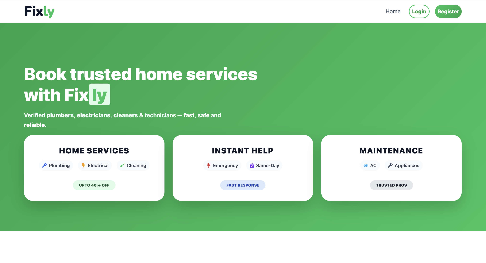

**Service Categories**
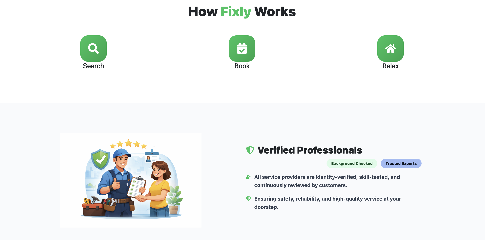

**Popular Services**
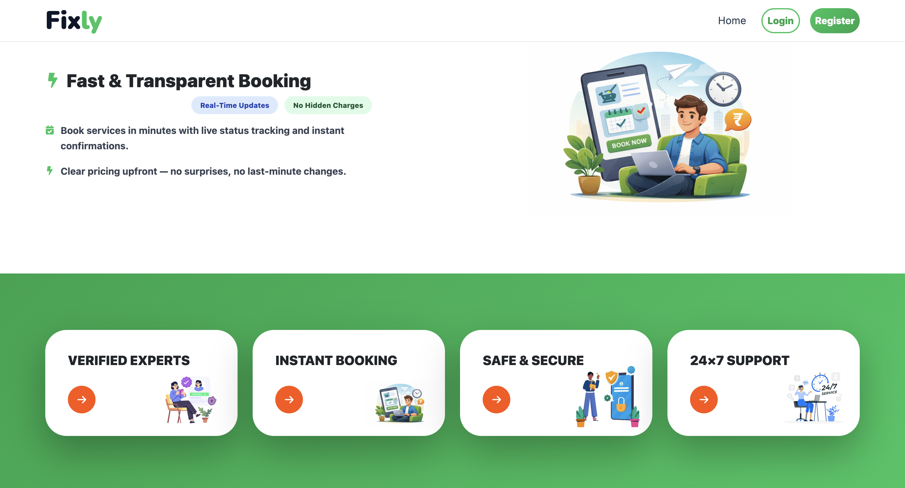

**Footer & CTA**
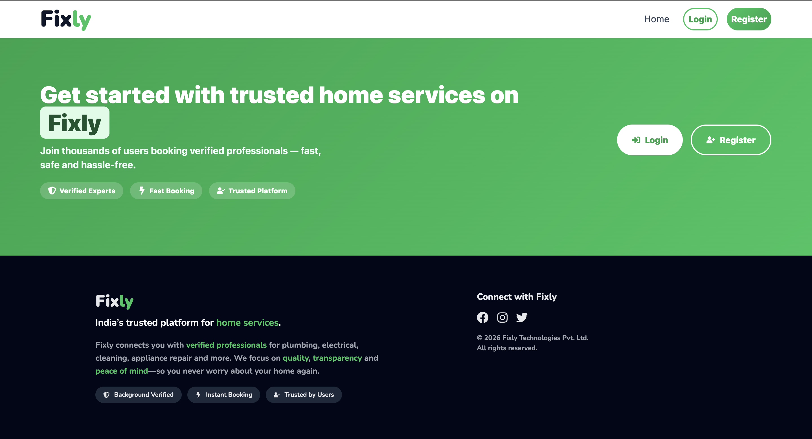

#### Login Page

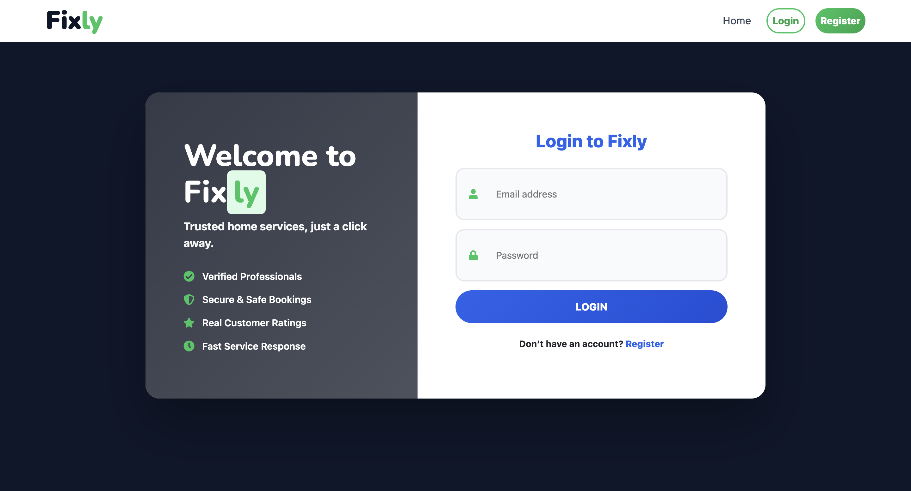

#### Registration Page


### User Dashboard

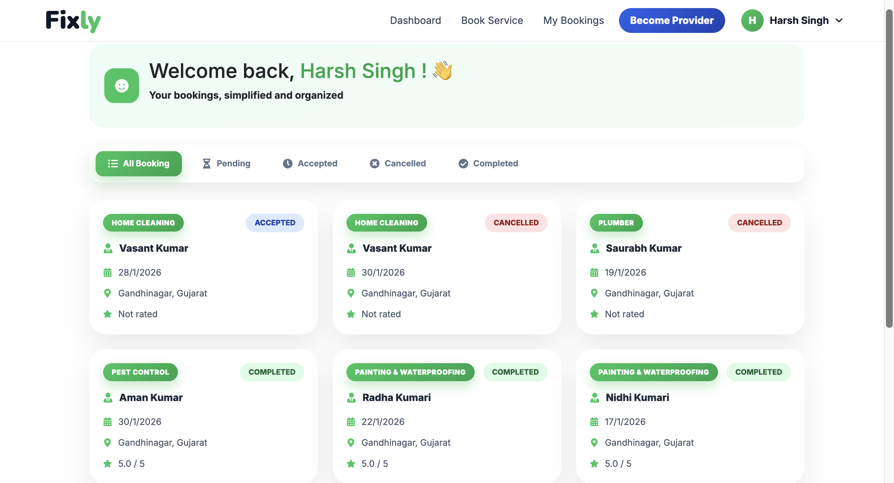

### Book Service

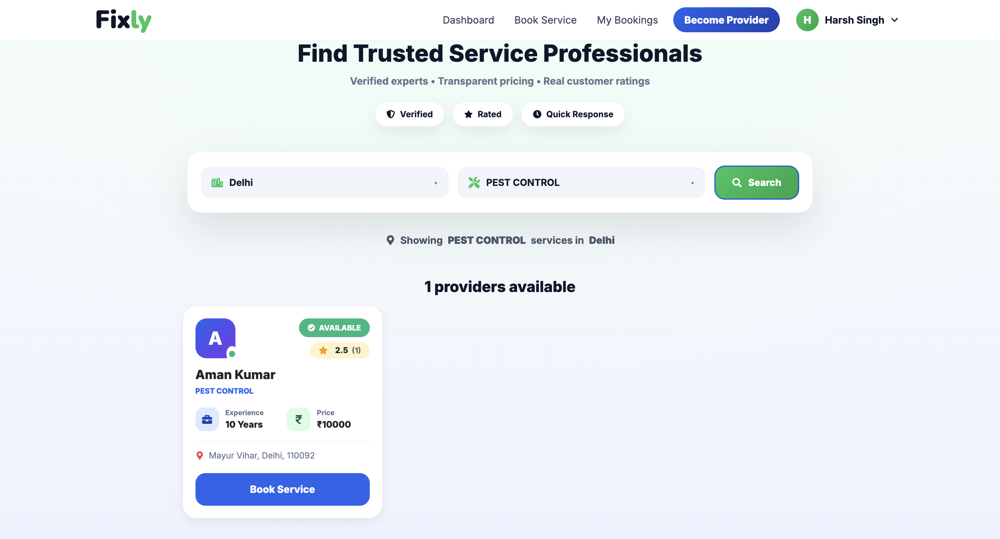

### User Bookings

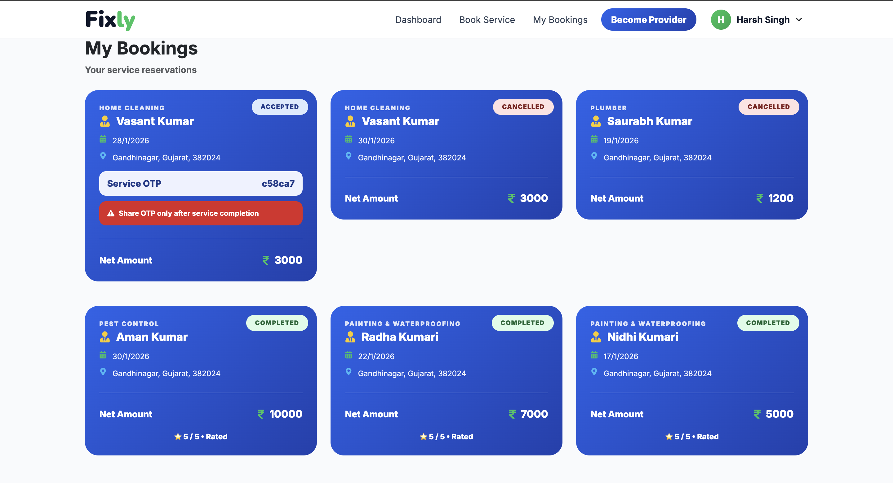

### Become Provider

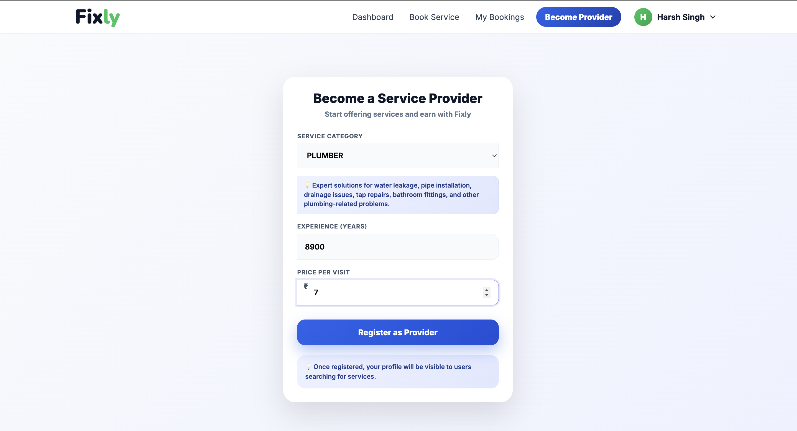

#### Provider Dashboard

**Provider Overview**
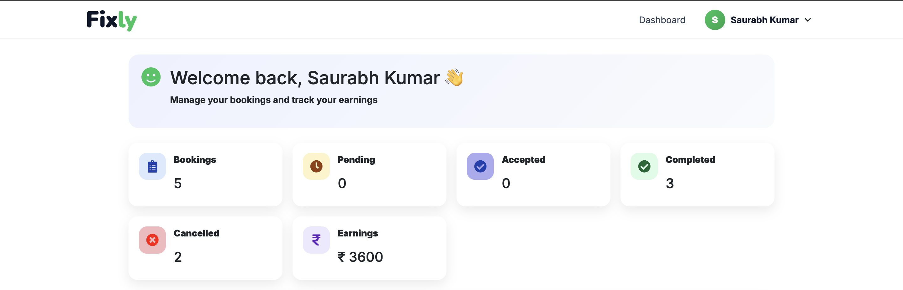

**Booking Management**
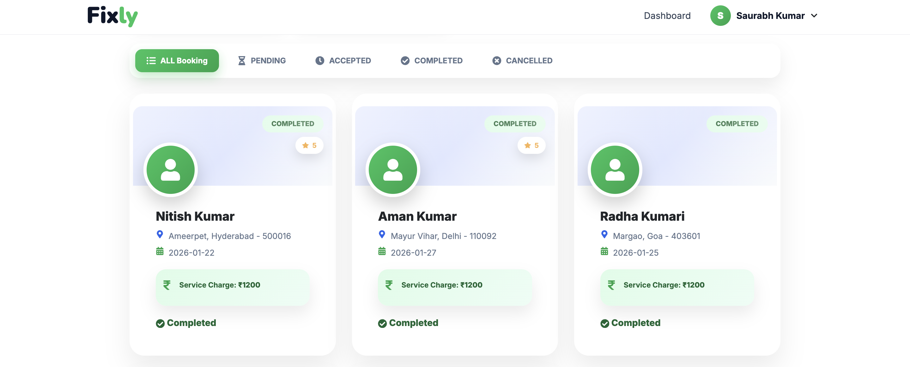

**Rating And Footer**
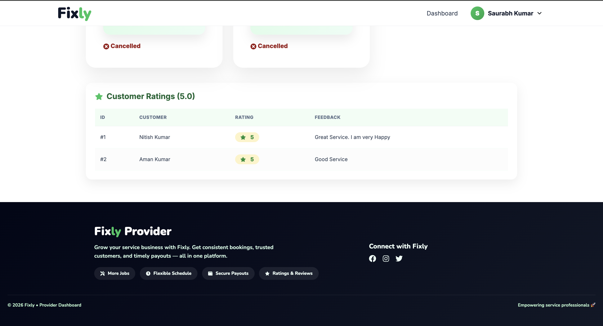

#### Admin Dashboard

**Admin Overview**
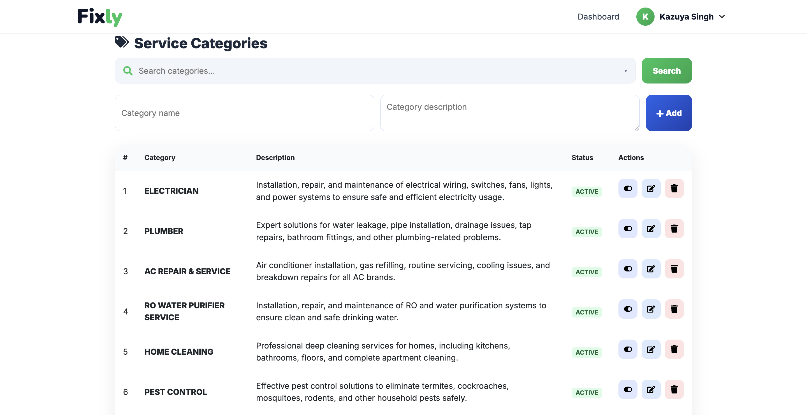

#### API Documentation (Swagger)

**User & Service categories APIs**
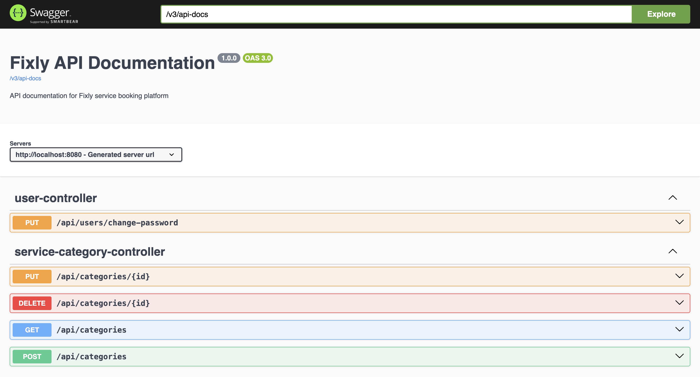

**Review & Booking APIs**
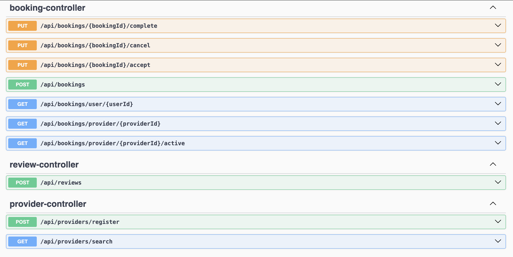

**Authentication & Address APIs**
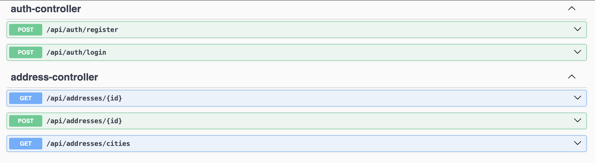

---

## 🔐 Environment Variables

Create `.env` files where required and configure:

- Database credentials
- API URLs
- Secret keys

⚠️ **Do not commit `.env` files to GitHub**

---

## 🤝 Contribution Guidelines

1. Fork the repository
2. Create a new branch (`feature/your-feature`)
3. Commit your changes
4. Push to your branch
5. Create a Pull Request

---

## 📜 License

© Fixly. All rights reserved.  
This project is proprietary and confidential.

---

## 👨‍💻 Author

**Fixly Team**  
Built with ❤️ to simplify service booking.
