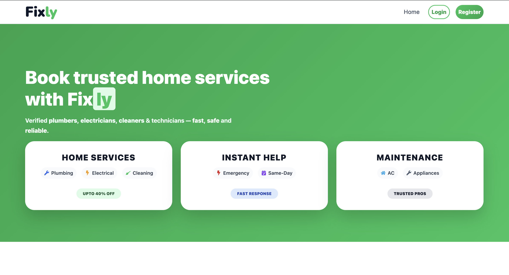
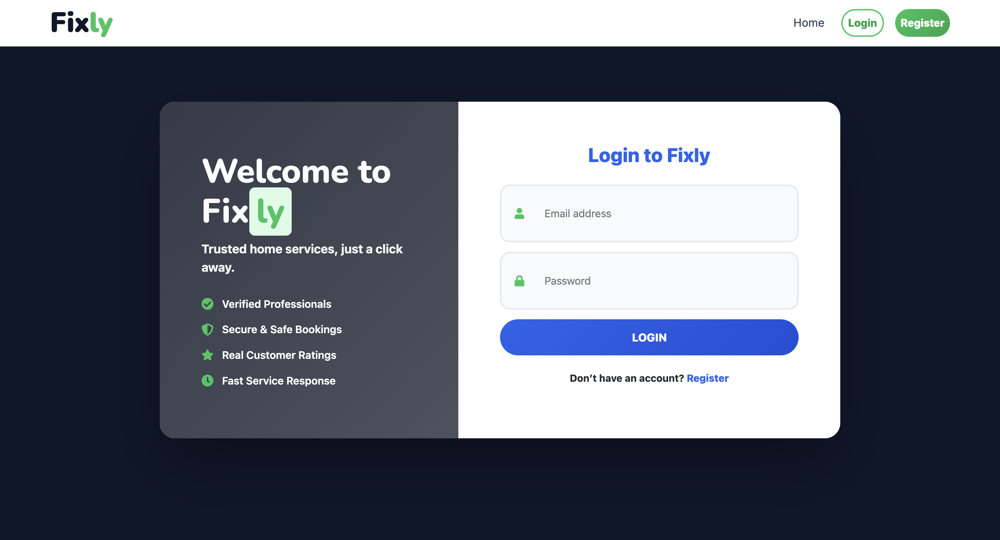
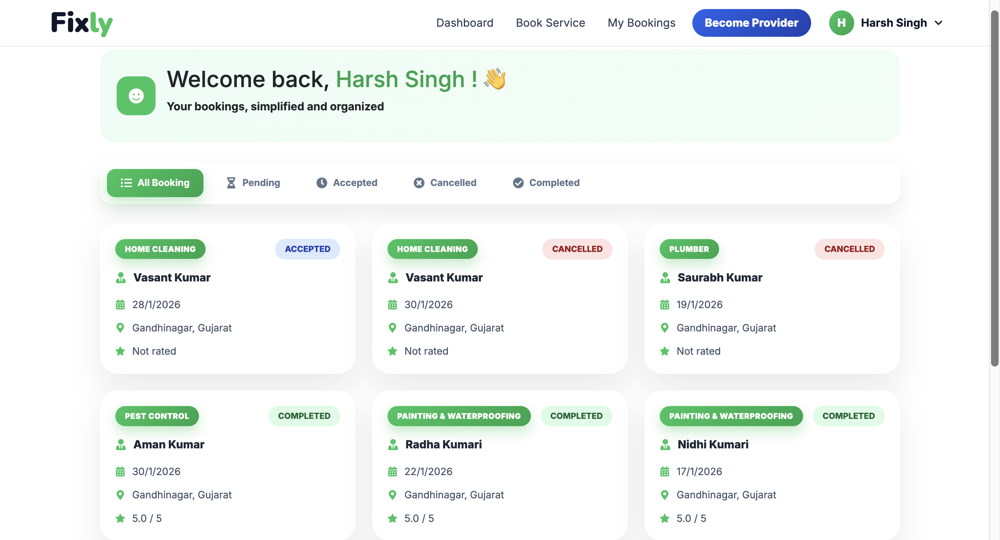
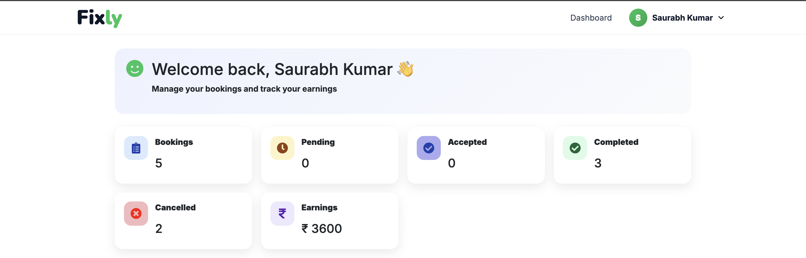
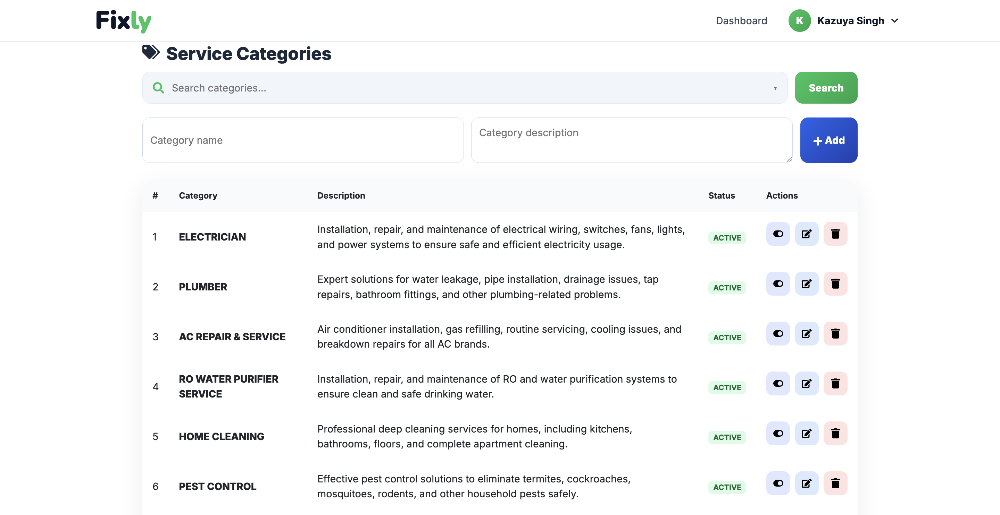
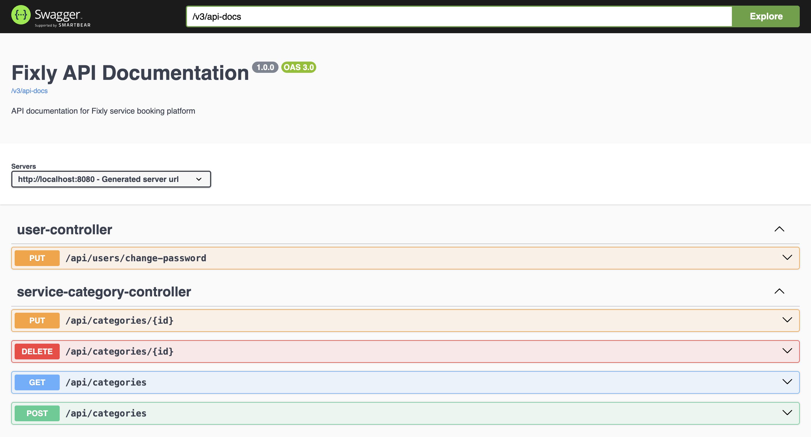

# Fixly Platform 🚀

Fixly is a full-stack service marketplace platform that connects customers with verified local service providers.

The platform enables users to discover services, book professionals, track service progress, receive notifications, and manage their service experience through a modern web application.

Fixly provides a complete ecosystem with three roles:

- 👤 User
- 🛠 Service Provider
- 🛡 Admin

---

# 📌 Project Overview

Fixly solves the problem of finding reliable local service professionals by providing:

- Service discovery
- Provider verification
- Online booking management
- OTP-based service completion
- Reviews and ratings
- Real-time notification system
- Role-based dashboards

---

# 🏗 Project Architecture

Fixly follows a monorepo structure:

```
Fixly
│
├── backend
│   └── Spring Boot REST API
│
├── frontend
│   └── React + Vite Application
│
└── screenshots
    └── Application Screenshots
```

---

# ✨ Features

## 👤 User Features

- User registration and login
- JWT based authentication
- Browse service categories
- Search service providers
- View provider details
- Add multiple addresses
- Book services
- Track booking status
- Receive booking notifications
- OTP based service verification
- Rate and review providers
- Manage profile
- Change password
- Notification center

---

# 🛠 Service Provider Features

- Provider registration
- Upload verification documents
- Admin approval workflow
- Provider dashboard
- Manage availability
- Receive booking requests
- Accept or reject bookings
- View customer details after acceptance
- Complete services using OTP verification
- View customer reviews
- Manage profile

---

# 🛡 Admin Features

- Admin dashboard
- Manage users
- Manage service providers
- Verify provider applications
- Approve providers
- Reject provider applications
- Suspend providers
- Manage service categories
- Monitor platform activity

---

# 🔔 Notification System

Fixly includes an in-app notification system.

Users receive notifications for:

- New bookings
- Booking acceptance
- Booking cancellation
- Service completion
- Provider approval
- Provider rejection
- Account updates
- New reviews
- Address updates

Features:

- Notification dropdown
- Notification center page
- Read/unread tracking
- Notification filtering
- Pagination

---

# 📧 Email Notification System

Fixly supports email communication for important events:

Examples:

- Welcome emails
- Booking confirmation
- Provider approval
- Password changes
- Service updates

(Email service powered by Spring Boot Mail)

---

# ⚙️ Tech Stack

## Backend

- Java 17
- Spring Boot
- Spring Security
- JWT Authentication
- Spring Data JPA
- Hibernate
- REST APIs
- MySQL
- Maven

## Frontend

- React JS
- Vite
- JavaScript ES6+
- HTML5
- CSS3
- Axios
- React Router
- React Icons

## Tools

- Git
- GitHub
- Postman
- Swagger UI
- VS Code

---

# 🔐 Security

Fixly implements:

- JWT authentication
- Role Based Authorization

Roles:

```
USER
PROVIDER
ADMIN
```

Protected routes are secured using Spring Security.

---

# 🚀 Installation & Setup

## Prerequisites

Install:

- Java 17+
- Node.js 18+
- MySQL
- Maven

---

# Backend Setup

Clone repository:

```bash
git clone https://github.com/Saurabhh0000/Fixly-Platform.git
```

Navigate:

```bash
cd Fixly/backend
```

Build project:

```bash
mvn clean install
```

Run application:

```bash
mvn spring-boot:run
```

Backend URL:

```
http://localhost:8080
```

---

# Frontend Setup

Navigate:

```bash
cd Fixly/frontend
```

Install dependencies:

```bash
npm install
```

Run development server:

```bash
npm run dev
```

Frontend URL:

```
http://localhost:5173
```

---

# 📘 API Documentation

Fixly uses Swagger OpenAPI documentation.

After running backend:

```
http://localhost:8080/swagger-ui/index.html
```

Swagger provides:

- API testing
- Request/Response documentation
- Endpoint details

---

# 🔗 API Overview

## Authentication

```
POST /api/auth/register

POST /api/auth/login

GET /api/auth/me
```

## Users

```
GET /api/users/{id}

PUT /api/users/{id}

PUT /api/users/change-password
```

## Providers

```
POST /api/providers/register

GET /api/providers/search

GET /api/providers/{id}

PUT /api/providers/status
```

## Bookings

```
POST /api/bookings

GET /api/bookings/user

GET /api/bookings/provider

PUT /api/bookings/{id}/accept

PUT /api/bookings/{id}/complete
```

## Reviews

```
POST /api/reviews

GET /api/reviews/provider/{id}
```

## Notifications

```
GET /api/notifications

GET /api/notifications/count

PUT /api/notifications/{id}/read

PUT /api/notifications/read-all
```

---

# 🌍 Deployment

Frontend:

```
Netlify
```

Backend:

```
Render
```

Database:

```
PostgreSQL / MySQL
```

---

# 📸 Screenshots

## Home Page



## Login



## User Dashboard



## Provider Dashboard



## Admin Dashboard



## Notification Center


## Swagger Documentation



---

# 🔒 Environment Variables

Create environment files:

Backend:

```
application.properties
```

Frontend:

```
.env
```

Example:

```
DATABASE_URL=
JWT_SECRET=
VITE_API_BASE_URL=
```

⚠️ Never commit environment files.

---

# 🤝 Contribution

1. Fork repository

2. Create branch

```
git checkout -b feature/new-feature
```

3. Commit changes

```
git commit -m "Added new feature"
```

4. Push branch

```
git push origin feature/new-feature
```

5. Create Pull Request

---

# 📜 License

This project is proprietary software.

© Fixly Platform

---

# 👨‍💻 Developer

**Saurabh Kumar**

Full Stack Developer

GitHub:
https://github.com/Saurabhh0000

Portfolio:
https://saurabh-kumar-dev.netlify.app

---

Built with ❤️ using Spring Boot + React
